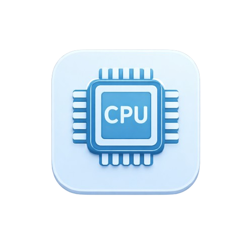
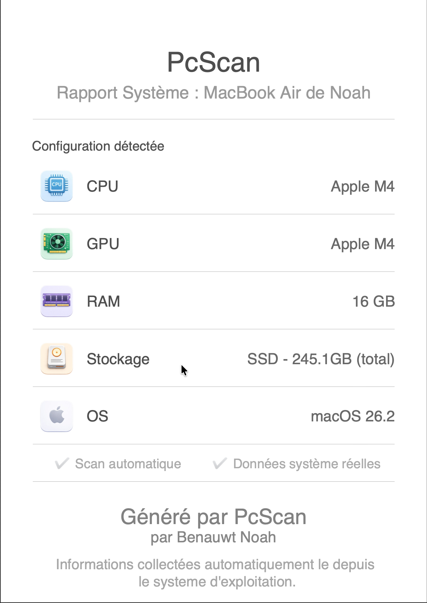

<div align="center">

# 🖥️ PcScan

### Scannez et documentez votre configuration système en un clic

[](https://www.python.org/)
[](LICENSE)
[]()



**Un outil simple et élégant pour scanner automatiquement votre configuration matérielle et générer un rapport PDF professionnel.**

[Fonctionnalités](#-fonctionnalités) •
[Installation](#-installation) •
[Utilisation](#-utilisation) •
[Structure](#-structure-du-projet) •
[Contributeur](#-contributeur)

</div>

---

## 📸 Aperçu

<div align="center">
  
  
  <br>
  <p><i>Interface principale • Rapport PDF généré</i></p>
</div>

---

## ✨ Fonctionnalités

🔍 **Scan automatique** des composants système
- 🧠 **CPU** - Processeur et modèle
- 🎮 **GPU** - Carte graphique
- 💾 **RAM** - Mémoire vive installée
- 💿 **Stockage** - Type (SSD/HDD) et capacité totale
- 🖥️ **OS** - Système d'exploitation et version

📄 **Génération de rapport PDF**
- Design professionnel et épuré
- Informations détaillées et formatées
- Export direct sur le bureau
- Ouverture automatique du PDF

🎨 **Interface moderne**
- Design minimaliste avec CustomTkinter
- Icônes personnalisées pour chaque composant
- Affichage clair et organisé
- Compatibilité multi-plateforme

---

## 🚀 Installation

### Prérequis

- Python 3.8 ou supérieur
- pip (gestionnaire de paquets Python)

### Installation des dépendances

```bash
# Cloner le repository
git clone https://github.com/noahbenauwt/PcScan.git
cd PcScan

# Installer les dépendances
pip install -r requirements.txt
```

### Dépendances principales

- `customtkinter` - Interface graphique moderne
- `fpdf2` - Génération de PDF
- `Pillow` - Gestion des images
- `reportlab` - Support PDF avancé

---

## 🎯 Utilisation

### Lancer l'application

```bash
python main_window.py
```

### Utilisation de l'interface

1. **Lancement** - L'application scanne automatiquement votre système
2. **Visualisation** - Consultez vos composants dans l'interface
3. **Génération PDF** - Cliquez sur "Générer le rapport PDF"
4. **Consultation** - Le PDF s'ouvre automatiquement sur votre bureau

---

## 📁 Structure du projet

```
PcScan/
│
├── main_window.py          # Interface graphique principale
├── pdf_generator.py        # Générateur de rapport PDF
├── system_info.py          # Collecte des informations système
├── assets_import.py        # Gestion des ressources pour PyInstaller
├── requirements.txt        # Dépendances Python
│
├── assets/                 # Ressources visuelles
│   ├── cpu.png
│   ├── gpu.png
│   ├── ram.png
│   ├── stockage.png
│   ├── os.png
│   └── ok.png
│
└── PcScan-Installer.dmg   # Installateur macOS
```

---

## 🛠️ Technologies utilisées

<div align="center">

| Technologie | Utilisation |
|------------|-------------|
|  | Langage principal |
|  | Interface graphique |
|  | Génération PDF |
|  | Traitement d'images |

</div>

---

## 🎓 Objectifs pédagogiques

Ce projet a été développé dans un cadre d'apprentissage pour maîtriser :

- ✅ La création d'interfaces graphiques avec CustomTkinter
- ✅ La manipulation de fichiers PDF avec FPDF2
- ✅ L'utilisation de commandes système avec subprocess
- ✅ La gestion des ressources pour la compilation avec PyInstaller
- ✅ Le développement multi-plateforme (Windows, macOS, Linux)
- ✅ L'organisation et la structure d'un projet Python

---

## 💡 Fonctionnalités spécifiques par OS

### 🪟 Windows
- Utilisation de `wmic` pour récupérer les informations matérielles
- Détection automatique du type de disque (SSD/HDD)

### 🍎 macOS
- Commandes `sysctl` et `system_profiler`
- Support complet des puces Apple Silicon (M1, M2, M3, M4)

### 🐧 Linux
- Lecture de `/proc/cpuinfo` et utilisation de `lspci`
- Compatibilité avec la plupart des distributions

---

## 👨‍💻 Contributeur

<div align="center">

**Benauwt Noah**

[](https://github.com/noahbenauwt)

*Projet développé dans le cadre de l'apprentissage de Python*

</div>

---

## 📝 License

Ce projet est sous licence MIT. Voir le fichier `LICENSE` pour plus de détails.

---
